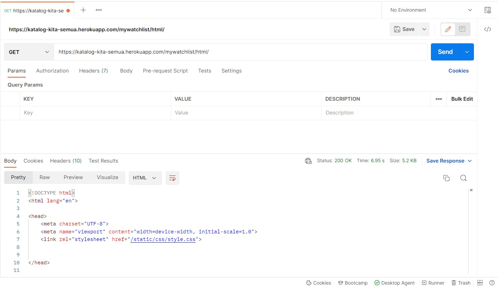
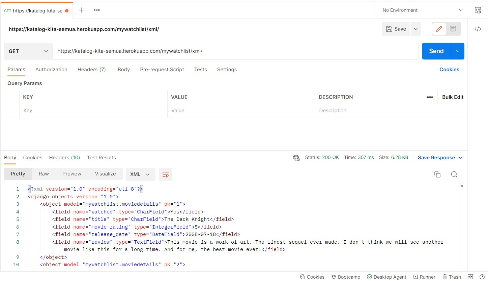
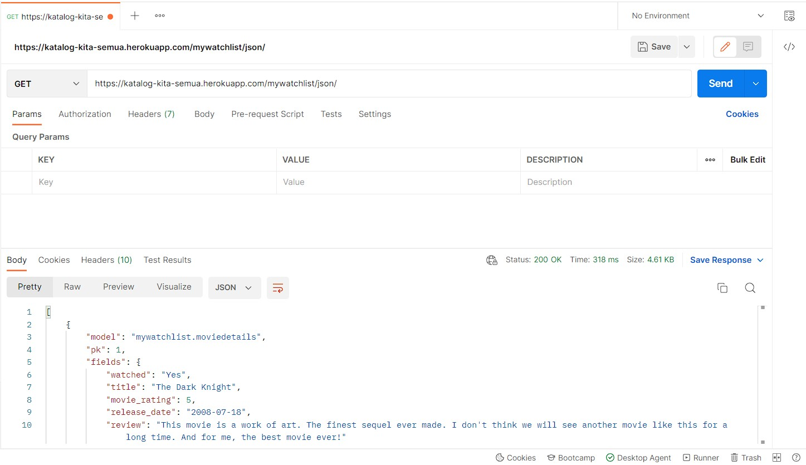

# Assignment 3
### App Links
html: https://katalog-kita-semua.herokuapp.com/mywatchlist/html/  
xml: https://katalog-kita-semua.herokuapp.com/mywatchlist/xml/  
json: https://katalog-kita-semua.herokuapp.com/mywatchlist/json/  

## Perbedaan antara JSON, XML, dan HTML
### JSON (JavaScripts Object Notation)
- JSON lebih sederhana, mudah dibaca, dan lebih cepat dibandingkan XML.
- JSON mengirimkan data dengan menguraikannya terlebih dahulu kemudian barulah dikirimkan melalui internet.
- JSON menggunakan penyimpanan secara efisien, namun tidak rapi untuk dilihat.

### XML (eXtensible Markup Language):
- XML lebih extensible dan rumit sehingga memiliki ukuran file yang besar.
- XML memiliki data yang lebih terstruktur dibandingkan JSON.
- Penyajian data di XML dilakukan secara sistematis sehingga rapi dan mudah dibaca, namun penyimpanan kurang efisien.

### HTML (HyperText Markup Language)
- Merupakan markup language yang digunakan untuk menyusun halaman web.
- HTML lebih berfokus kostumisasi tampilan web, berbeda halnya dengan XML atau JSON yang fokus pada struktur dan konteks data.

## Pentingnya data delivery dalam pengimplementasian sebuah platform
Untuk menampilkan data pada sebuah platform kita membutuhkan data yang dimuat dalam database. Dengan proses data delivery ini, data yang ada di dalam database dikirimkan melalui internet agar tersedia di server untuk kemudian digunakan dalam pengimplementasian platform.

## Cara pengimplementasian tugas 3
1. Menambahkan folder proyek baru dengan command `python manage.py startapp mywatchlist`.
2. Menambahkan `path('mywatchlist/', include('mywatchlist.urls'))` pada `urls.py` yang terdapat pada `project_django`.
3. Menambahkan `'mywatchlist'` pada bagian `INSTALLED_APPS` yang terdapat pada `settings.py`.
4. Membuat sebuah class `MovieDetails` pada models.py yang berisikan lima atribut yang akan ditampilkan pada web (watched,title,etc).
5. Membuat fungsi untuk menampilkan tampilan html, xml, dan json.
6. Menambahkan sebuah folder `fixtures` di dalam folder `mywatchlist` yang berisi `initials_mywatchlist_data.json`. File ini akan diisi dengan data-data movie yang akan ditampilkan pada website.
7. Menambahkan sebuah folder `templates` di dalam folder `mywatchlist` yang berisikan file `mywatchlist.html` untuk mengatur tampilan website dengan mengambil data dari `views.py`.
8. Menambahkan path html, xml, dan json sebagai routing.
9. Menjalankan command makemigrations dan migrate. Menjalankan loaddata untuk mengupdate data di server dengan data pada database.

### POSTMAN-html

### POSTMAN-xml

### POSTMAN-json
